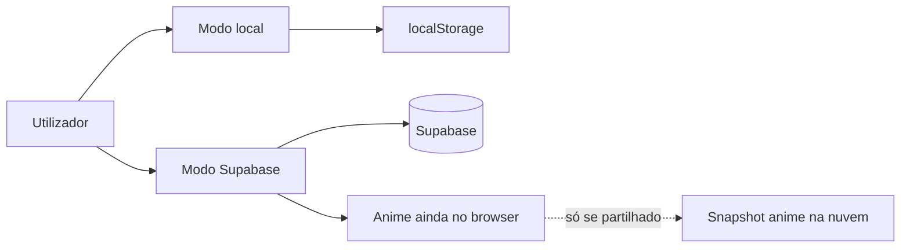

# DeckVault — MVP

**Produto:** gestor de coleção TCG (Yu-Gi-Oh!, Pokémon, Digimon) + coleção anime opcional.  
**Estado:** MVP funcional (local + cloud opcional).  
**Fonte de escopo:** `.cursor/rules/deckvault-project.mdc` + README.

---

## Objetivo do MVP

Permitir que um colecionador:

1. Guarde e organize cartas (várias coleções / vistas)
2. Adicione cartas (pesquisa / import)
3. Exporte e faça **backup por ficheiro JSON**
4. Use a **Anime Collection** (série → personagem → cartas)
5. Imprima proxies
6. (Opcional) Entre com conta, partilhe coleções/anime e veja activity com undo simples

Sem conta o app funciona em **modo local** (dados no browser).

---

## Atores

| Ator | Descrição |
|------|-----------|
| **Visitante / Local** | Usa o app sem login; dados no `localStorage` |
| **Utilizador cloud** | Conta Supabase; coleções próprias na nuvem |
| **Owner** | Dono da coleção ou workspace anime partilhado |
| **Editor** | Convidado com permissão de editar |
| **Viewer** | Convidado só a ver |

---

## Em escopo (MVP)

| Área | Casos de uso |
|------|----------------|
| Auth | Entrar / sair (opcional) |
| Coleção TCG | Ver (grid, binder, tabela, compact), pesquisar, quick add, editar quantidade, apagar |
| Coleções | Criar / mudar coleção ativa, favoritar |
| Import / Export | Importar decklist/CSV/YDK/YDKE; exportar TXT/CSV/YDK |
| Backup | Download JSON; restore (local = substitui; cloud TCG = merge/soma) |
| Anime | Séries, personagens, cartas; binder; confirm em deletes; sync só se partilhado |
| Share | Convidar por email (editor/viewer) — TCG e/ou Anime |
| Activity | Ver log; undo de ações simples de carta |
| Proxy print | Montar folhas e imprimir |
| Settings | Perfil / preferências; backup |
| Mercado | Links externos (não preços live) |

---

## Fora de escopo (removido / não MVP)

- Deck builder, Wishlist, Folders, Tags
- Histórico de preços, Trading, Notificações
- Comunidade / Phase 4
- Presence realtime (live “quem está online”)

---

## Modos de dados



- **TCG cloud:** coleções / owned cards no Supabase  
- **Anime:** sempre no demo store local; **sync de snapshot** só quando o workspace está partilhado (membros reais)

---

## Diagrama de casos de uso

```mermaid
flowchart TB
  subgraph Actors
    LocalUser((Visitante / Local))
    CloudUser((Utilizador cloud))
    Owner((Owner))
    Editor((Editor))
    Viewer((Viewer))
  end

  subgraph System["DeckVault"]
    UC01([UC01 Ver coleção])
    UC02([UC02 Pesquisar e adicionar carta])
    UC03([UC03 Importar decklist / CSV])
    UC04([UC04 Exportar coleção / deck])
    UC05([UC05 Gerir coleções])
    UC06([UC06 Backup JSON download])
    UC07([UC07 Restore backup])
    UC08([UC08 Gerir Anime Collection])
    UC09([UC09 Proxy print])
    UC10([UC10 Entrar / sair])
    UC11([UC11 Partilhar coleção TCG])
    UC12([UC12 Partilhar Anime])
    UC13([UC13 Sync Anime partilhada])
    UC14([UC14 Ver activity / undo])
    UC15([UC15 Abrir links Mercado])
    UC16([UC16 Settings / perfil])
  end

  LocalUser --> UC01
  LocalUser --> UC02
  LocalUser --> UC03
  LocalUser --> UC04
  LocalUser --> UC05
  LocalUser --> UC06
  LocalUser --> UC07
  LocalUser --> UC08
  LocalUser --> UC09
  LocalUser --> UC15
  LocalUser --> UC16

  CloudUser --> UC10
  CloudUser --> UC01
  CloudUser --> UC02
  CloudUser --> UC03
  CloudUser --> UC04
  CloudUser --> UC05
  CloudUser --> UC06
  CloudUser --> UC07
  CloudUser --> UC08
  CloudUser --> UC09
  CloudUser --> UC15
  CloudUser --> UC16

  Owner --> UC11
  Owner --> UC12
  Owner --> UC13
  Owner --> UC14

  Editor --> UC01
  Editor --> UC02
  Editor --> UC13
  Editor --> UC14

  Viewer --> UC01
  Viewer --> UC13
```



### Relação include / extend (resumo)

| Caso | Depende de / nota |
|------|-------------------|
| UC13 Sync Anime | Só se workspace partilhado; Pull/poll + merge + lápides |
| UC07 Restore | Local: substitui estado; Cloud TCG: merge por nome de coleção |
| UC11 / UC12 | Requer UC10 (conta) |
| UC08 deletes | Confirm modal; lápides têm prioridade no sync |

---

## Fluxos críticos (MVP)

### 1. Backup (sempre disponível)

1. Settings → Download backup → JSON no disco  
2. Restore → confirmação → reaplica dados  

### 2. Anime partilhada

1. Owner convida email (hub de share, Anime marcado)  
2. Convidado aceita → passa a membro  
3. Sync liga (meta `isShared`) → Pull / push / merge  
4. Delete confirmado → tombstone → não volta no Pull  

### 3. Coleção TCG partilhada

1. Owner convida editor/viewer  
2. Membros veem a coleção; editores alteram  
3. Activity regista ações simples; undo quando suportado  

---

## Critérios de “MVP pronto”

- [x] Usar sem conta (modo local)  
- [x] Adicionar / ver / editar quantidade / apagar cartas  
- [x] Import + export básicos  
- [x] Backup JSON download + restore  
- [x] Anime Collection utilizável offline  
- [x] Proxy print  
- [x] Cloud opcional + share TCG  
- [x] Share anime + sync só quando partilhado  
- [x] Activity + undo simples  

---

## Test plan — sync / share anime

Checklist manual (dois browsers ou telemóvel + PC; conta cloud com **membro aceite**, não só convite pendente):

1. **Invite → accept → Pull** — owner convida; convidado aceita; ambos veem badge/Pull de sync (não no modo local).
2. **Add/remove carta e personagem** — com confirm no delete; o outro lado vê após Pull/refresh.
3. **Qty não dobra** — alterar quantidade, refresh/Pull; quantidade usa o maior valor em conflito, nunca `1+1=2` automático.
4. **Sem partilha** — modo local, ou cloud sem membros reais: **sem** badge “Cloud sync”, **sem** botão Pull; empty state não oferece Pull.

Smoke automático (merge):

```bash
npx tsx scripts/smoke-anime-share-merge.ts
```

**Lighthouse (auditoria de performance):** relatórios em `docs/audit-artifacts/lighthouse-*.report.{html,json}`.

Última medição **produção local** (`next build` + `next start`, modo local sem redirect de auth):

| Página | Perf | A11y | Best Practices | SEO |
|--------|------|------|----------------|-----|
| `/login` | 98 | 91 | 100 | 100 |
| `/collection` | 76 | 87 | 100 | 100 |

Nota: em `next dev` os scores de Performance caem muito (~70) — isso é normal. Com Supabase ligado, `/collection` redireciona para `/login` sem sessão, por isso a medição da collection foi em build local-mode.

Screenshots/`knip-raw.txt` na mesma pasta são histórico opcional.


---

## Roadmap depois do MVP

**Agora (polish):** UX da coleção, caps/rate limit nas APIs, collab estável.  

**Depois (opcional):** stats, bulk edit além de delete, virtualização do binder, melhorias de sync anime.

---

## Como ver o diagrama

- No GitHub / GitLab o Mermaid renderiza no Markdown  
- No VS Code / Cursor: preview Markdown com extensão Mermaid  
- Ou cola o bloco em [mermaid.live](https://mermaid.live)
